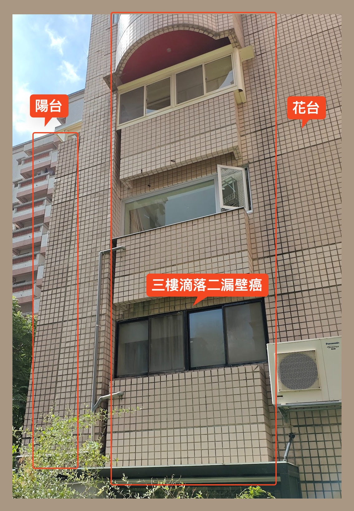

# 南棟-3 陽台排水管阻塞

## 事件描述

1. 3-3 住戶反應 5-6 年前，南棟 3-3陽台排水管阻塞，管委會嘗試通管 3,4 次，但無法解決問題。
2. 2樓 將花台和陽台的排水孔堵死 3樓的住戶將陽台的排水孔堵死 花台未堵死, 排水出口為3樓的花台並滴落到2樓的花台,導致 2 樓的花台和陽台的花台都有積水，並導致壁癌
3. 3-3 住戶最近因裝潢 將花台的排水孔堵死，導致水從4樓 的陽台地板冒出 再由4樓的明管排出, 但如遇大雨或樓上洗衣機排水時，水會從4樓的陽台地板冒出，因排水不及淹入室內
4. 前日修繕,文書,出納,會計前往４樓檢查，發現4樓的陽台排水管有阻塞，從明管排出如採用堵塞的方法 因4樓之上的花台以變為陽台, 且無明管會導致水直接淹入室內毀損財物

## 延伸問題

1. 如持續使用封堵的方式, 會導致封堵的樓層越來越高，最後只能廢棄整個暗管，改為明管。 且因費用龐大，管委會無直接決定權，需全體大會通過。
2. 封堵的樓層越高會導致通管的難度增加，費用增加 包通廠商原報價6000 元 後因2樓3樓以堵死排水孔，4樓通管需加價至10000元
3. 後續如因家具毀損導致用戶向管委費索賠,會造成管委會財務壓力

## 解決方案

1. 通管(投票中)
  - 一包通廠商報價10000元  如不通則不收錢，(採用傳統通管機方式)
  - 內視鏡加水刀通管35000 - 40000元，如不通則酌收8000元內視鏡費用
2. 開孔接明管
  - 因暗管包在水泥中，無法確認暗管的位置且開孔可能影響大樓結構 
3. 整個暗管作廢，改為明管
  - 費用龐大需全體大會通過

 
## 個人建議

個人建議採用內視鏡加水刀通管，因先前傳統通管方式看起來無法徹底解決問題即便有通可能又很快阻塞，內視鏡加水刀通管的費用較高，但如果失敗也只需支付8000元內視鏡費用，內視鏡看到的結果可作為開孔接明管或整個暗管作廢的參考依據。

| 辦法 | 優點 | 缺點 | 成本 | 結果 |
|----------|----------|----------|----------|----------|
| 傳統通管    | Data     | 先前經驗成效不彰     | 0     | 失敗 (9/7) 包通判斷水刀應該也不會通(不確定包通是否有水刀設備)     |
| 水刀    | 比傳統通管更強力([參考影片](https://www.youtube.com/watch?v=29QG3WzZOmQ) )     | 可能弄破管線    | 40000 不通(8000內視鏡費用)     | TBD     |
| 4樓暗管轉明管＋頂樓排水專用明管    | 明管日好維修     | 價格不低 4-3 會變成一個封閉存水彎, 堵塞時可能要再挖開地板    | 待估價     | TBD     |

