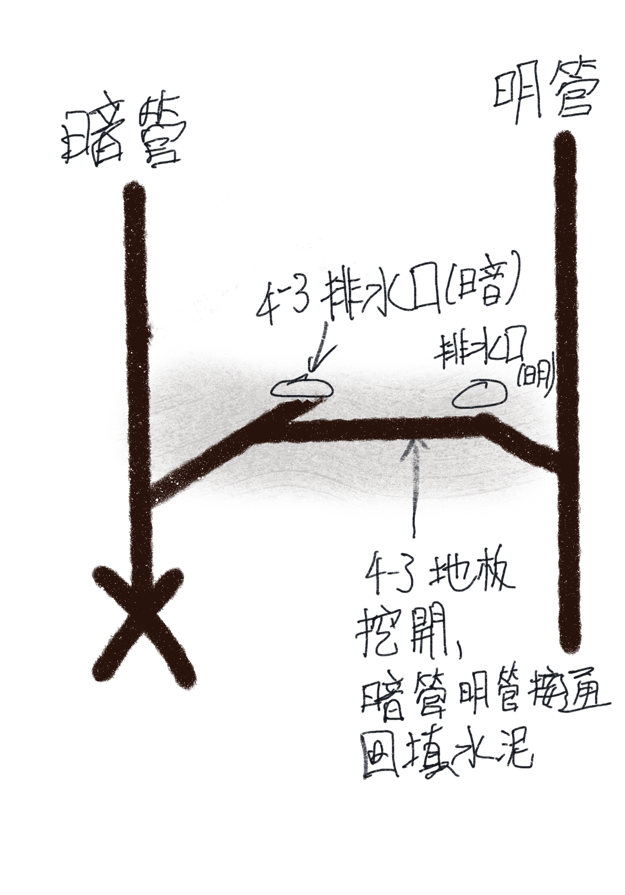

# 南棟-3 陽台排水管阻塞

## 4-3 陽台排水管阻塞可能處理方案

| 辦法 | 優點 | 缺點 | 成本 | 結果 |
|----------|----------|----------|----------|----------|
| 傳統通管    | Data     | 先前經驗成效不彰     | 0     | 失敗 (9/7) 包通判斷水刀應該也不會通(不確定包通是否有水刀設備)     |
| 水刀    | 比傳統通管更強力([參考影片](https://www.youtube.com/watch?v=29QG3WzZOmQ) )     | 可能弄破管線(如有裂縫需在暗管破口更上方處將暗管堵死, 有可能有裂縫微漏水卻不知道)    | 40000 不通(8000內視鏡費用)     | TBD     |
| 4樓暗管轉明管＋頂樓排水專用明管 (避免大雨回水)    | 明管日好維修    | 價格不低可能需過住戶大會 另外需與4-3 協商    | 待估價     | TBD     |

明管轉暗管示意圖:

