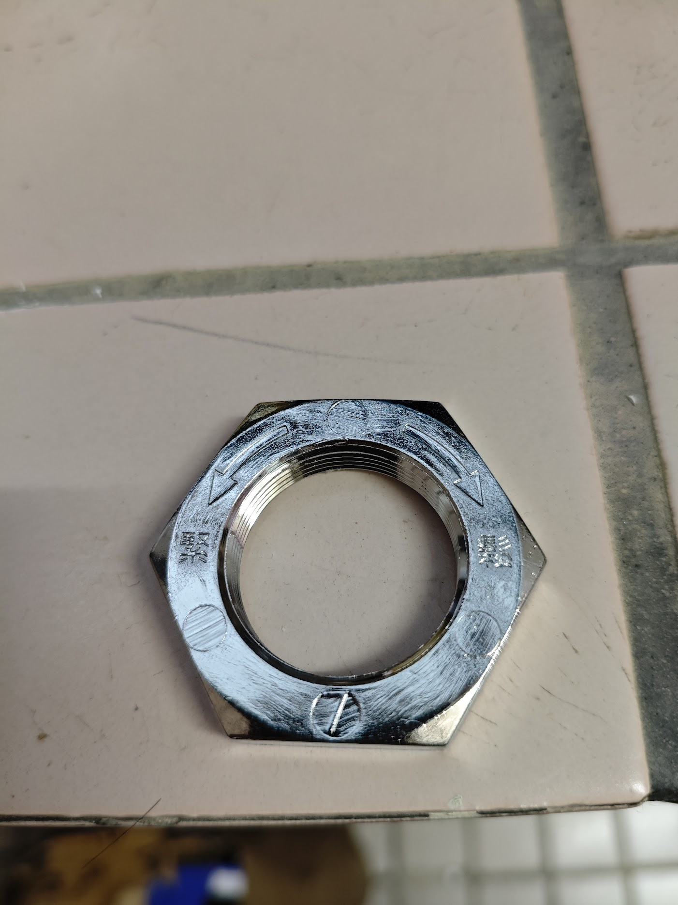

# Washing Machine Cleaning

## Tools

- 電動起子
- 衝擊扳手

## 清洗步驟

- 電器清洗時，請先拔掉電源線
- 關閉水源
- 拆開上蓋1
- 拆開後背板 解開水管和電線固定裝置
- 拆開上蓋2 並固定
- 拆下波輪
- 拆下 41mm 螺斯 注意 oring
- 拆下 洗衣機平衡環
- 使用逼猴拆下桶身 注意 oring
- 清潔塑膠桶身
- 清潔金屬桶身
- 裝回並測試

## 風險提示

- 軸上的螺絲拆卸時請注意方向避免損壞, 聲寶反牙螺絲
  

- 拆開上蓋時留意上蓋感應開關

- 建議兩人一同操作, 避免意外發生或破壞機構

