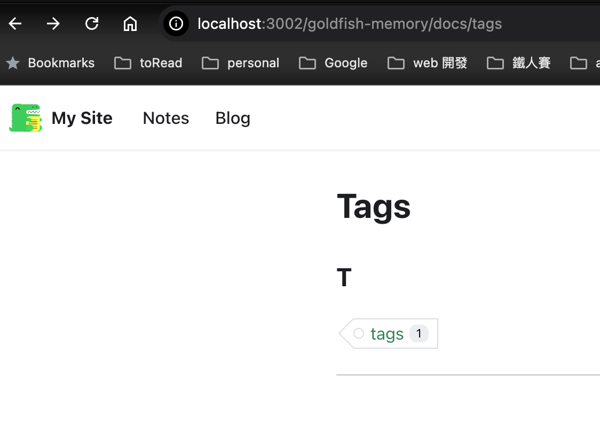

### Docusarus tags

#### Add tags to your article

In docusarus you can add tags to your article in the meta data

```markdown

---
slug: tag-intro
title: tag-intro
authors: [jasonwu]
tags: [tags]
---

```

#### Search article by tags

if you want to search article by tags, you can
go to below url 


url/baseurl/docs/tags

or 

url/baseurl/blog/tags

  


#### shorten search result

 If you do not want to show whole post in the search result, you can add truncate, then the search result will only show the content before the truncate

```markdown
  <!-- truncate -->
```