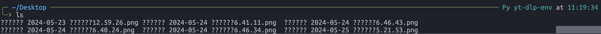
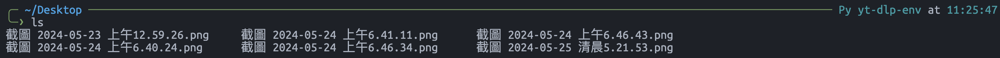

# ZSH & BASH 比較

## 為什麼選擇 ZSH 而非 BASH?

### BASH 的局限性
BASH 是一個功能強大的 shell，但在特定情況下可能會顯得不足。它的自動完成功能相對簡單，擴展性有限，當需要更複雜的腳本或操作時，往往需要依賴其他編程語言如 Perl 或 Python。

### ZSH 的優勢

1. **更強大的自動完成功能**：ZSH 的自動完成不僅功能豐富，還能根據上下文提供更精確的建議，讓使用者在編寫命令時更加高效。
  
2. **豐富的擴展功能**：ZSH 擁有豐富的插件和主題庫，這些擴展功能能增強 shell 的功能，甚至能夠大幅提升終端的使用體驗，如美化外觀和提高生產力。

3. **更好的兼容性**：ZSH 與大部分 BASH 腳本兼容，並且提供更多功能，使得從 BASH 遷移到 ZSH 更加容易和無縫。

4. **智能的歷史記錄管理**：ZSH 的歷史記錄管理更為智能，能幫助用戶快速查找和重複使用之前的命令。

5. **強大的正則表達式支持**：ZSH 對正則表達式的支持更為強大和靈活，讓用戶能夠更輕鬆地進行複雜的文本處理。

### 總結
ZSH 相比 BASH 擁有更強大的自動完成、擴展功能、兼容性、歷史記錄管理和正則表達式支持等優勢，這使得 ZSH 成為更為強大且靈活的 shell 選擇。對於追求高效和定制化的 shell 體驗的用戶，ZSH 是值得推薦的替代方案。

## ZSH 安裝與配置

### 安裝 ZSH 和設置預設 shell
安裝 ZSH 非常簡單，只需使用 `sudo apt install zsh`。ZSH 提供了更靈活的命令處理，如不區分大小寫、可複製貼上命令而不立即執行等。安裝完成後，使用 `chsh` 命令將 ZSH 設為預設 shell，這樣每次打開終端時將自動使用 ZSH。

### 安裝 Oh My Zsh 和 Powerlevel10k 主題
為了進一步提升 ZSH 的功能和外觀，可以安裝 Oh My Zsh 管理框架。該框架不僅提供多種插件和主題，還使管理和定制 ZSH 更加方便。其中，Powerlevel10k 是一款強大的主題，可以顯示豐富的終端資訊，如分支名稱、工作目錄狀態、命令執行時間等。

### 自訂 Powerlevel10k 主題
安裝完成後，可以根據個人喜好自訂 Powerlevel10k 主題，例如保留彩虹色、使用 Unicode 圖示、顯示分支資訊等。此過程需要配置字型，如 MesloLGS Nerd Font，確保所有圖示正常顯示。

### 使用自訂提示符號
自訂提示符號能提供更豐富的即時資訊，如顯示當前分支名稱、工作目錄狀態及命令執行時間等，這樣可以在操作過程中更直觀地掌握系統狀態。

### 遇到中文顯示問題
  

```bash
vim ~/.zshrc
```


設定成 UTF-8 編碼
```vim
# 在 ~/.zshrc 中加入以下內容
export LC_ALL="en_US.UTF-8"
export LANG="en_US.UTF-8"
```

```bash
source ~/.zshrc
```

  


## 參考資料

1. [為什麼選擇 ZSH 而非 BASH?](https://www.reddit.com/r/linuxquestions/comments/p50jvl/those_of_you_who_prefer_zsh_to_bash_why/)
2. [將 Ubuntu 終端機轉換為具有豐富資訊的提示符號](https://www.youtube.com/watch?v=PZTLIVQxxEY)

3. [zsh 終端出現中文亂碼](https://blog.csdn.net/love131452098/article/details/122348809)