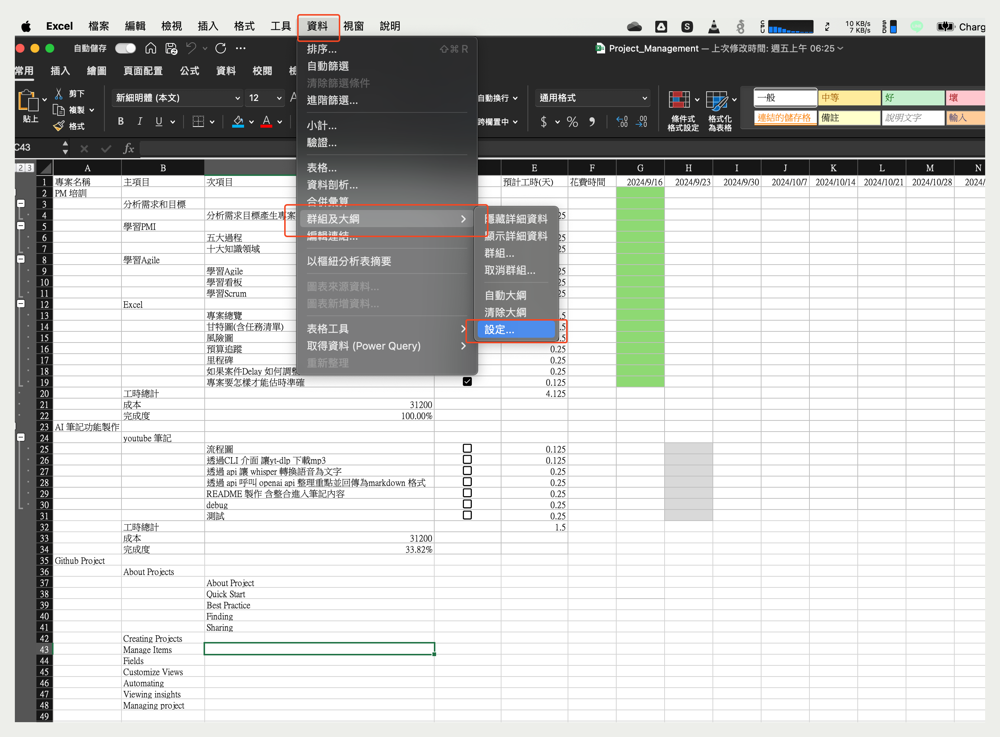
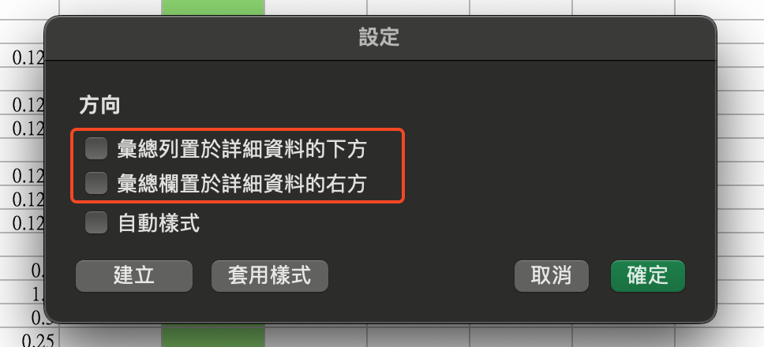

# 群組

## 說明

Excel 群組功能是一個可以將多個Row 或 Column 合併成一個群組的功能，這樣可以讓我們在編輯表格時，可以將不需要的資料隱藏起來，讓我們可以專注在我們需要的資料上。

## 預設

預設收核按鈕在群組的右邊和下面(通常為隱藏計算用參數, 只保留計算後的結果), 但是有時候我們會需要將收核按鈕放在群組的左邊或上面，這時候我們可以透過以下的方法來調整。

  

  

## 參考資料

- [Excel 群組功能](https://answers.microsoft.com/en-us/msoffice/forum/all/how-to-change-excels-group-outline-collapse/2945f729-2b59-43c0-b259-9b20c231737f)