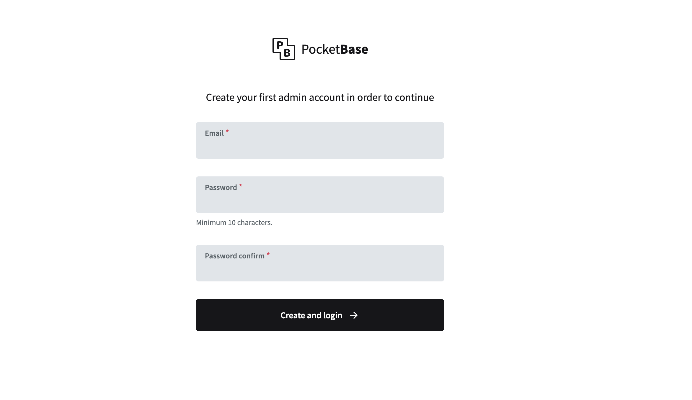
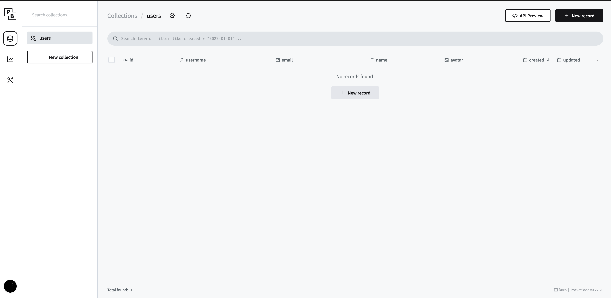
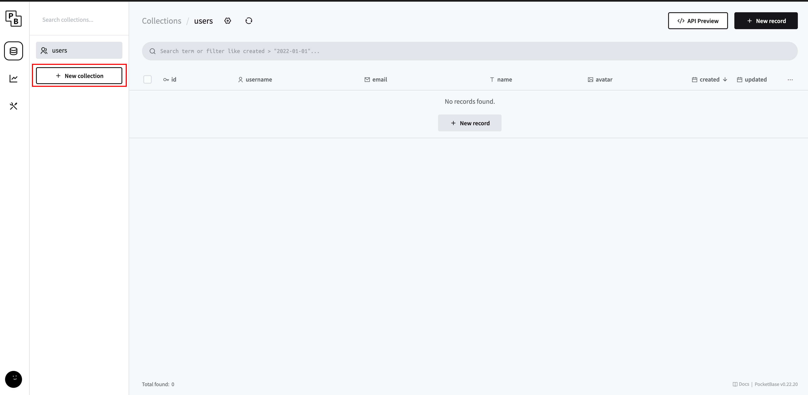

# Pocketbase

## 使用目的

Pocketbase 是一個簡單的資料庫系統, 可以用來存放資料, 並進行 CRUD 操作。
適合用來做為小型專案的資料庫系統, 例如: 簡單的網站、小型應用程式等或著是mock server。

## Installation

1. 前往 github [pocketbase ](https://github.com/pocketbase/pocketbase/releases) 下載最新版本的 Pocketbase 安裝檔,  如果是 Mac Arm cpu, 請下載 `pocketbase-darwin-arm64`。
2. 解壓縮 Pocketbase 安裝檔。
3. mv Pocketbase 至 專案目錄。
4. 進入 Pocketbase 目錄, 執行 `./pocketbase` 即可啟動 Pocketbase。
5. 開啟瀏覽器, 輸入 `http://localhost:8080` 即可開始使用 Pocketbase。
6. 填寫基本資料, 完成註冊。

## Pocketbase CRUD 操作範例

1. 初始畫面

2. 新增Collection, Collection 是一個資料表, 用來存放資料。 可以想像成一個 Excel 的工作表 或是資料庫的 Table。

- 點擊 **＋ New Collection** 新增 Collection

- 輸入 Collection 名稱, 並點擊 **＋ New filed** 按鈕

- 設定  Field 類型後輸入 Field 名稱, 並點擊 **Create** 按鈕

